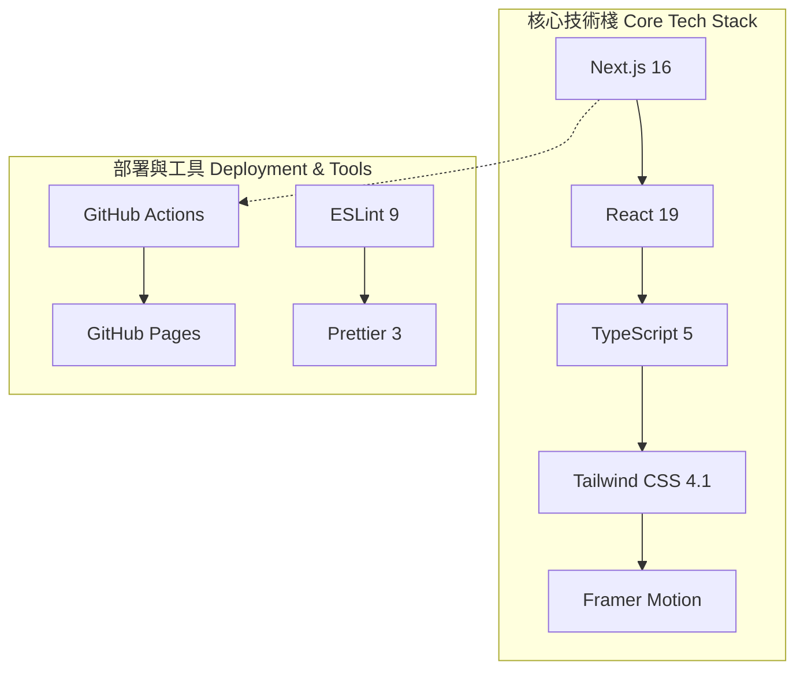
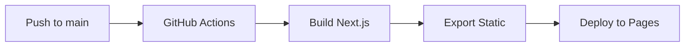
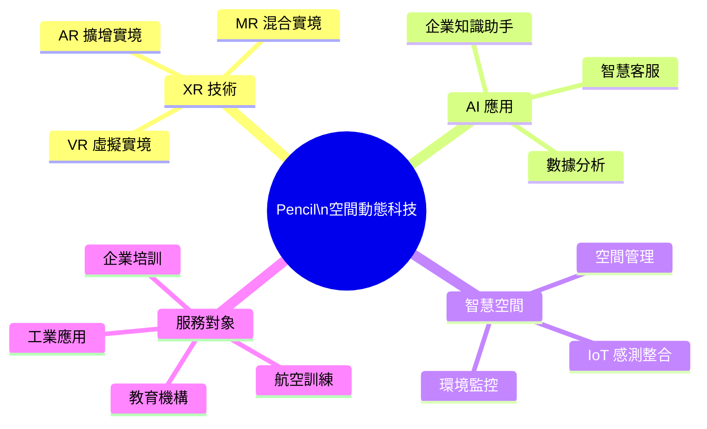

# Pencil 空間動態科技

> Pencil Spatial Dynamics Technology - Official Website

## 項目簡介

Pencil（空間動態科技）是專注於 XR（VR/AR/MR）、AI 大數據、5G/6G 網路及五感互動技術整合的創新型企業。我們以「We Build The OASIS」為願景，致力於打造次世代的沉浸式互動體驗，為企業與機構提供專業的數位轉型解決方案。

---

Pencil (Spatial Dynamics Technology) is an innovative enterprise specializing in the integration of XR (VR/AR/MR), AI big data, 5G/6G networks, and sensory interaction technologies. With the vision of "We Build The OASIS," we are dedicated to creating next-generation immersive interactive experiences, providing professional digital transformation solutions for enterprises and institutions.

## 技術架構



### 技術規格

| 技術 | 版本 | 用途 |
|------|------|------|
| Next.js | 16.1.6 | React 框架與靜態導出 |
| React | 19.0.0 | UI 元件庫 |
| TypeScript | 5.x | 型別安全開發 |
| Tailwind CSS | 4.1.18 | 原子化 CSS 樣式 |
| Framer Motion | 12.0.0 | 動畫與互動效果 |
| clsx/lite | 2.1.1 | 條件類名處理 |

## 項目結構

```
PencilWeb/
├── .github/workflows/     # GitHub Actions 部署配置
├── public/                # 靜態資源
│   └── .nojekyll         # 禁用 Jekyll 處理標記
├── src/
│   ├── app/              # Next.js App Router 頁面
│   │   ├── about/        # 關於我們
│   │   ├── contact/      # 聯絡我們
│   │   ├── projects/     # 專案展示
│   │   ├── solutions/    # 解決方案
│   │   ├── technology/   # 技術核心
│   │   └── ...
│   ├── components/
│   │   ├── elements/     # 基礎元件
│   │   ├── sections/     # 頁面區塊
│   │   │   └── swiss/   # Swiss Design 風格組件
│   │   └── providers/    # Context Provider
│   └── locales/          # 多語言翻譯檔案
│       ├── zh-TW.json   # 繁體中文
│       ├── en.json      # 英文
│       └── ja.json      # 日文
├── next.config.ts        # Next.js 配置
├── tailwind.config.ts   # Tailwind 配置
└── package.json         # 依賴管理
```

## 安裝與運行

### 環境要求

- Node.js 20 或更高版本
- npm 或 pnpm

### 開發指令

```bash
# 安裝依賴
npm install

# 啟動開發伺服器
npm run dev

# 建構生產版本
npm run build

# 執行程式碼檢查
npm run lint
```

### 部署流程

本專案使用 GitHub Actions 自動部署至 GitHub Pages：



部署網址：`https://jensonlohtw.github.io/PencilWeb/`

## 開發規範

### 代碼風格

- **語言**：TypeScript 嚴格模式
- **樣式**：Tailwind CSS 原子化類名
- **組件**：函數式組件 + React Hooks
- **動畫**：Framer Motion 聲明式動畫

### 提交規範

```
類型: 簡短描述

- feat: 新功能
- fix: 錯誤修復
- docs: 文檔更新
- style: 代碼格式（不影響功能）
- refactor: 重構
- deploy: 部署相關
```

## 公司願景與價值觀

### 願景 Vision

> 「We Build The OASIS」

OASIS 代表 **O**pen **A**ccess **S**patial **I**nteractive **S**ystem（開放式空間互動系統），我們以此為願景，致力於打破虛擬與現實的邊界，創造無縫融合的空間體驗。

### 核心價值觀

1. **挑戰優先的務實精神** - 先定義業務目標與限制，再選擇最適技術
2. **快速驗證的開發哲學** - 透過 PoC 與階段式部署，早期驗證價值
3. **長期營運的永續思維** - 持續監測與優化，確保方案永續發展

## 業務領域



### 解決方案

| 方案 | 說明 | 應用場景 |
|------|------|----------|
| **VR/MR 沉浸式訓練** | 高擬真虛擬環境訓練系統 | 飛行訓練、工業操作、醫療培訓 |
| **AR 視覺化** | 擴增實境資訊疊加 | 設備維修、展場導覽、教育展示 |
| **智慧空間 IoT** | 感測器網路與空間管理 | 智慧工廠、辦公空間、倉儲管理 |
| **中小企業 AI** | 客製化 AI 助理與知識庫 | 客戶服務、內部培訓、文件管理 |

### 團隊理念

我們相信技術應該**服務於人**，而非讓人遷就於技術。每個專案都從深入理解客戶需求開始，透過跨領域團隊協作，將複雜的技術轉化為直覺、高效的解決方案。

**團隊組成**：
- 解決方案架構師（挑戰定義、架構設計、部署路線圖）
- XR 體驗團隊（互動設計、內容製作、設備整合）
- AI 與數據團隊（代理工作流、數據治理、模型整合）

---

## 彩蛋專區

<details>
<summary>點擊展開彩蛋</summary>

### 彩蛋 1：專案代號的由來

專案代號 **"Oatmeal"**（燕麥片）其實是早期內部原型時的暫時命名，因為團隊在第一次全體會議時集體吃了燕麥片早餐，後來雖然改名為 Pencil，但 `package.json` 中的 `"name": "oatmeal-demo"` 保留了這段歷史。

### 彩蛋 2：隱藏的設計哲學

所有 Swiss Design 風格組件的 CSS 類名都以 `swiss-` 為前綴，但這並非巧合。設計師特別選用瑞士國際主義風格（Swiss Style）的網格系統與字體規範，呼應公司追求精確、簡潔、功能導向的核心價值。

### 彩蛋 3：語言切換的秘密

語言切換組件（`LanguageToggle`）的循環順序是：中文 → 英文 → 日文 → 中文。這個順序對應著公司發展的三個階段：台灣起家（中文）、拓展國際（英文）、深化日韓市場（日文）。每次切換都是一段發展歷程的縮影。

</details>

---

## 授權與聯絡

本專案為 Pencil 空間動態科技官方網站原始碼，保留所有權利。

**總部**：高雄市

**業務洽詢**：請透過網站表單或 Email 聯絡

---

*最後更新：2025 年 2 月*
