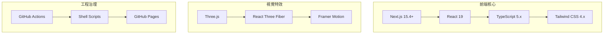

# Pencil 空間動態科技 (PencilWeb)

> Pencil Spatial Dynamics Technology - Official Website

Pencil（空間動態科技）是專注於 XR (VR/AR/MR)、AI 大數據、5G/6G 網路及五感互動技術整合的創新型企業。本專案為其官方網站，採用現代化 Web 技術棧建構，強調高效能與極致的視覺互動體驗。

## 技術架構

### 核心技術棧


### 技術規格
| 技術 | 版本 | 用途 |
|------|------|------|
| **Next.js** | 15.4.x | React 框架與靜態導出 (SSG) |
| **React** | 19.x | UI 元件與狀態管理 |
| **TypeScript** | 5.x | 型別安全開發 |
| **Tailwind CSS** | 4.x | 原子化樣式系統 |
| **Three.js** | 0.182+ | 3D 渲染引擎 |
| **Framer Motion**| 12.x | 聲明式動畫與微互動 |

## 項目結構

```
PencilWeb/
├── docs/                  # 正式文件 (ADR, Release Notes)
├── discuss/               # 方案討論與 Waiver 申請紀錄
├── scripts/               # 唯一准許的開發與維護腳本入口
├── src/
│   ├── app/               # 路由、全域樣式與 Providers
│   ├── features/          # 核心功能模組 (Marketing, Solutions, Tech)
│   ├── components/        # 高階 UI 元件與動畫
│   ├── shared/            # 共用基礎設施 (hooks, lib, types, ui primitives)
│   └── i18n/              # 國際化語系 (zh-TW, en, ja)
├── public/                # 靜態資源、3D 模型與圖標
└── tests/                 # 單元、整合與 E2E 測試
```

## 開發指令

根據專案工程規範，**嚴禁直接**呼叫底層包管理具。所有操作必須透過 `scripts/` 下的腳本執行。

| 指令 | 腳本路徑 | 用途 |
|------|----------|------|
| **安裝** | `./scripts/install.sh` | 初始化專案環境與依賴 |
| **開發** | `./scripts/start.sh` | 啟動 Next.js 開發伺服器 |
| **檢查** | `./scripts/check.sh` | 執行 Lint、型別與目錄規格檢查 |
| **測試** | `./scripts/test.sh` | 執行所有測試案例 |
| **建置** | `./scripts/build.sh` | 執行生產版本建置與靜態導出 |

## 工程治理準則

本專案遵循嚴格的開發規範：
- **單檔限制**：TypeScript 檔案一律控制在 200 行以內。
- **目錄扁平**：每層資料夾檔案數上限為 8 個，超過即拆分子目錄。
- **Linus 方法論**：追求「好品味（Good Taste）」代碼，消除特殊情況，保持設計簡潔。
- **無虛擬實作**：所有提交必須可執行且通過 `check.sh`。

## 公司願景

> **「We Build The OASIS」**

OASIS 代表 **Open Access Spatial Interactive System**。我們致力於打破虛擬與現實的邊界，透過空間動態技術為企業提供次世代的數位轉型解決方案。

---
最後更新：2026 年 2 月
